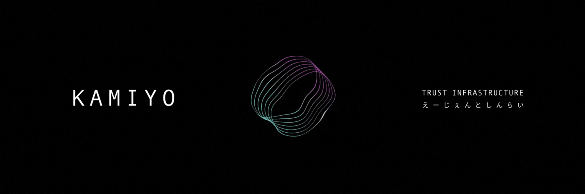

# KAMIYO



Trust infrastructure for autonomous agents. Solana, Base, Monad, Hyperliquid.

Agents transact with stake-backed identities. Disputes go to multi-oracle consensus with private voting. ZK proofs for reputation thresholds.

**[Dashboard](https://protocol.kamiyo.ai)** | **[Solscan](https://solscan.io/account/8sUnNU6WBD2SYapCE12S7LwH1b8zWoniytze7ifWwXCM)** | **[API](https://api.kamiyo.ai)**

## Features

- **Agent Identity** - PDA-based identities with stake collateral
- **Escrow Agreements** - Time-locked payments between agents and providers
- **Dispute Resolution** - Multi-oracle commit-reveal consensus with outlier detection
- **Reputation Tracking** - On-chain trust scores with ZK threshold proofs
- **Private Payments** - ShadowWire integration for shielded transfers
- **Multi-chain** - Solana, Base, Monad, Hyperliquid
- **Agent Frameworks** - ElizaOS, Daydreams, LangChain, Vercel AI, MCP

## How It Works

```
Agent                          Provider
  │                               │
  │  1. Create Agreement          │
  ├──────────────────────────────►│
  │     (funds locked)            │
  │                               │
  │  2. Service Delivered         │
  │◄──────────────────────────────┤
  │                               │
  ├─── 3a. Release ──────────────►│  Happy path
  │                               │
  └─── 3b. Dispute ───┐           │  Unhappy path
                      ▼
              ┌──────────────┐
              │   Oracles    │
              │  commit/reveal│
              └──────┬───────┘
                     │
              ┌──────▼───────┐
              │  Settlement  │
              │   0-100%     │
              └──────────────┘
```

### Dispute Resolution

Oracles vote on service quality using commit-reveal:

1. **Commit** - Oracle submits `SHA256(domain || session_id || oracle || score || salt)`
2. **Delay** - 5 min commit window, 30 min reveal window
3. **Reveal** - Oracle reveals score and salt, hash verified on-chain
4. **Settle** - Median score with outlier detection, 72h timeout fallback

| Quality Score | Agent Refund | Provider Payment |
|--------------|--------------|------------------|
| 80-100% | 0% | 100% |
| 65-79% | 35% | 65% |
| 50-64% | 75% | 25% |
| 0-49% | 100% | 0% |

## Installation

```bash
npm install https://gitpkg.vercel.app/kamiyo-ai/kamiyo-protocol/packages/kamiyo-sdk?main
```

## Quick Start

```typescript
import { KamiyoClient, AgentType } from '@kamiyo/sdk';
import { Connection, Keypair } from '@solana/web3.js';
import BN from 'bn.js';

const connection = new Connection('https://api.mainnet-beta.solana.com');
const wallet = Keypair.generate();
const client = new KamiyoClient({
  connection,
  wallet: {
    publicKey: wallet.publicKey,
    signTransaction: async (tx) => { tx.sign(wallet); return tx; },
    signAllTransactions: async (txs) => { txs.forEach(tx => tx.sign(wallet)); return txs; },
  }
});

// Create agent with 0.5 SOL stake
const tx = await client.createAgent({
  name: 'TradingBot',
  agentType: AgentType.Trading,
  stakeAmount: new BN(500_000_000)
});

// Create payment agreement
await client.createAgreement({
  provider: providerPubkey,
  amount: 100_000_000,
  timeLockSeconds: 86400,
  transactionId: 'order-123'
});

// Release on success, or dispute for arbitration
await client.releaseFunds('order-123', providerPubkey);
// or: await client.markDisputed('order-123');
```

## Architecture

```
┌─────────────────────────────────────────────────────────┐
│                    KAMIYO Program                       │
├─────────────────┬─────────────────┬────────────────────┤
│  Agent Identity │    Escrow       │   Oracle Registry  │
│  - PDA          │  - Create       │   - Register       │
│  - Stake        │  - Release      │   - Commit/Reveal  │
│  - Reputation   │  - Dispute      │   - Commit/Reveal  │
└─────────────────┴─────────────────┴────────────────────┘
```

## Solana Programs

| Program | Description |
|---------|-------------|
| `kamiyo` | Main protocol - agent identity, escrow, oracle voting, Groth16 ZK verification |
| `mitama` | ZK-private agent collaboration with Poseidon merkle proofs |
| `kamiyo-escrow` | Companion escrow for pay-only-if-it-helped model |
| `kamiyo-governance` | Token-weighted governance voting |
| `kamiyo-staking` | Single-sided staking with duration multipliers |
| `kamiyo-transfer-hook` | MEV protection for $KAMIYO (SPL Transfer Hook) |

## Packages

### Core

| Package | Description |
|---------|-------------|
| `@kamiyo/sdk` | TypeScript SDK for identity, escrow, privacy proofs, voting |
| `@kamiyo/agent-core` | Observability, retry, caching, rate limiting, ZK reputation |
| `@kamiyo/actions` | Plug-and-play actions for payments and disputes |
| `@kamiyo/middleware` | Express middleware for HTTP 402 |
| `@kamiyo/solana-common` | Shared Solana utilities |

### Agent Frameworks

| Package | Description |
|---------|-------------|
| `@kamiyo/eliza` | ElizaOS plugin for autonomous agent payments |
| `@kamiyo/daydreams` | Daydreams extension with MCP tools |
| `@kamiyo/langchain` | LangChain tools for escrow and disputes |
| `@kamiyo/vercel-ai` | x402 payment tools for Vercel AI SDK |
| `@kamiyo/mcp-server` | MCP server for Claude and LLM agents |

### Payments

| Package | Description |
|---------|-------------|
| `@kamiyo/x402-client` | x402 client with PaymentWidget, Jupiter swaps, escrow |
| `@kamiyo/radr` | Radr ShadowWire integration for private payments with escrow |
| `@kamiyo/solana-inference` | Quality-escrowed inference payments |

### Chain Adapters

| Package | Description |
|---------|-------------|
| `@kamiyo/helius-adapter` | Helius RPC adapter with webhooks |
| `@kamiyo/monad` | Monad parallel execution and PDA emulation |
| `@kamiyo/hyperliquid` | Hyperliquid copy trading integration |
| `@kamiyo/blindfold` | Blindfold Finance card issuance with ZK reputation gates |

### Infrastructure

| Package | Description |
|---------|-------------|
| `@kamiyo/surfpool` | Surfpool simulation and pre-flight validation |
| `@kamiyo/switchboard-function` | Switchboard oracle for quality scoring |
| `@kamiyo/dkg-quality-oracle` | OriginTrail DKG quality oracle |
| `@kamiyo/solana-reputation` | On-chain reputation tracking |

### ZK & Privacy

| Package | Description |
|---------|-------------|
| `@kamiyo/kamiyo-mitama` | ZK agent collaboration SDK |
| `@kamiyo/kamiyo-mitama-prover` | ZK proof generation for Mitama |
| `@kamiyo/kamiyo-mitama-merkle` | Poseidon merkle tree for agent membership |
| `@kamiyo/solana-privacy` | Private inference proofs (Groth16) |
| `noir/` | Noir circuits + Solana verifier (UltraPlonk) |
| `circuits/` | Circom circuits for reputation and oracle voting |
| `crates/kamiyo-zk` | Halo2-based ZK proofs (no trusted setup) |

### EVM Contracts

| Contract | Description |
|----------|-------------|
| `contracts/zk-reputation/` | ZKReputation on Base mainnet - Groth16 verifier |
| `contracts/monad/` | Swarm simulator, reputation mirror, agent proxy |
| `contracts/hyperliquid/` | Agent registry, vault, copy trading integration |

## x402 Integration

KAMIYO provides the trust layer for [x402](https://www.x402.org/) payments:

```typescript
import { X402KamiyoClient } from '@kamiyo/x402-client';

const client = new X402KamiyoClient({
  connection,
  wallet,
  programId: KAMIYO_PROGRAM_ID,
  qualityThreshold: 70,  // Auto-dispute below this
  maxPricePerRequest: 0.1,
});

// Request with automatic payment + escrow protection
const response = await client.request('https://api.provider.com/data', {
  useEscrow: true,
  sla: { maxLatencyMs: 5000 },
});

// SLA violation triggers automatic dispute
if (!response.slaResult?.passed) {
  // Funds held in escrow, oracle consensus determines settlement
}
```

x402 handles payments. KAMIYO ensures they were earned.

## API

```typescript
// PDA derivation
getAgentPDA(owner: PublicKey): [PublicKey, number]
getAgreementPDA(agent: PublicKey, txId: string): [PublicKey, number]

// Account fetching
getAgent(pda: PublicKey): Promise<AgentIdentity | null>
getAgreement(pda: PublicKey): Promise<Agreement | null>

// Operations
createAgent(params: CreateAgentParams): Promise<string>
createAgreement(params: CreateAgreementParams): Promise<string>
releaseFunds(txId: string, provider: PublicKey): Promise<string>
markDisputed(txId: string): Promise<string>
```

## Development

```bash
npm install
anchor build
anchor test
npm run build --workspaces
```

## Program Addresses

### Solana

| Network | Program ID |
|---------|------------|
| Mainnet | `8sUnNU6WBD2SYapCE12S7LwH1b8zWoniytze7ifWwXCM` |
| Devnet | `8sUnNU6WBD2SYapCE12S7LwH1b8zWoniytze7ifWwXCM` |

| Account | Address |
|---------|---------|
| Protocol Config | `E6VhYjktLpT91VJy7bt5VL7DhTurZZKZUEFEgxLdZHna` |
| Treasury | `8xi4TJcPmLqxmhsbCtNoBcu7b8Lfnubr3GY1bkhjuNJF` |
| Oracle Registry | `2sUcFA5kaxq5akJFw7UzAUizfvZsr72FVpeKWmYc5yuf` |

### Base Mainnet

| Contract | Address |
|----------|---------|
| ZKReputation | `0x0e0Eb714c0860B5e4AC29a4f54951FF7fBF04dA5` |
| Groth16Verifier | `0xE467c6d2586CBC34feB4D9c6Cb7dB07E1b57341a` |

### Monad Testnet

| Contract | Address |
|----------|---------|
| AgentProxy | `0x87f9ac00d727a1ee8d1c246b67e2d0eb1a2206b2` |
| ReputationMirror | `0x7f4c878e7b2b083878f0ba3d2de2c6db995b1a11` |
| SwarmSimulator | `0xcaa2e2d77e09c4ec48830ada7abc711607350ea5` |

### Hyperliquid Mainnet

| Contract | Address |
|----------|---------|
| AgentRegistry | `0xCa034D63c67ADd6CA127a575F0097C203DAcaE9d` |
| KamiyoVault | `0xF5B2b62f014459B98991AaE001e33aF75f4fbD15` |
| ReputationLimits | `0xbECa9c722EeF9897b5aa87363F3Bd9C94e16fE33` |

**Fees:**
- Companion escrow creation: 50 KAMIYO (1% burned, 99% to treasury)
- 7-day timeout on active escrows
- 72-hour timeout fallback on disputed escrows

## Security

See [SECURITY.md](SECURITY.md).

- 2-of-3 multi-sig for pause/unpause/treasury
- Oracle slashing: 10% per violation
- Agent slashing: 5% for frivolous disputes
- Auto-removal after 3 violations
- 7-day grace period on escrows
- Rent exemption checks on all SOL transfers
- Ed25519 signature verification with instruction iteration
- Token mint validation for SPL escrows
- Protocol fees for both SOL and SPL token disputes

## License

MIT. See [LICENSE](LICENSE).

---

[KAMIYO](https://kamiyo.ai)

