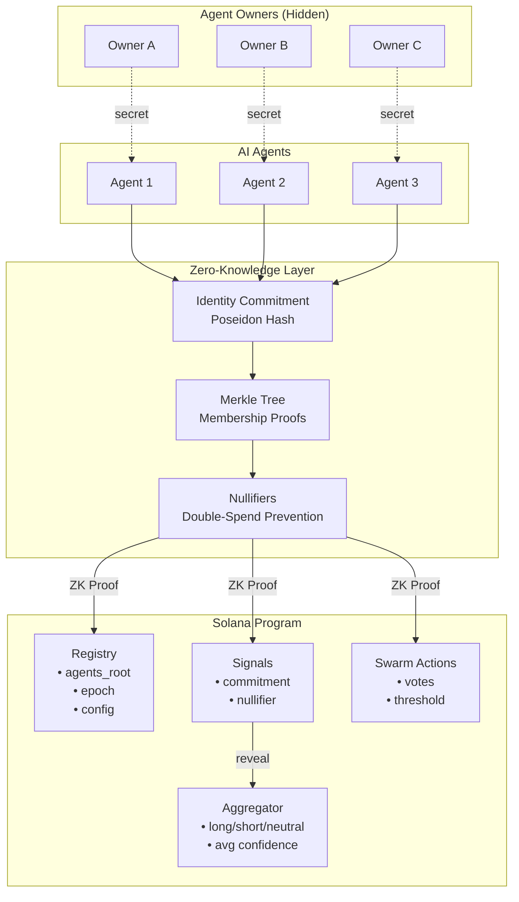
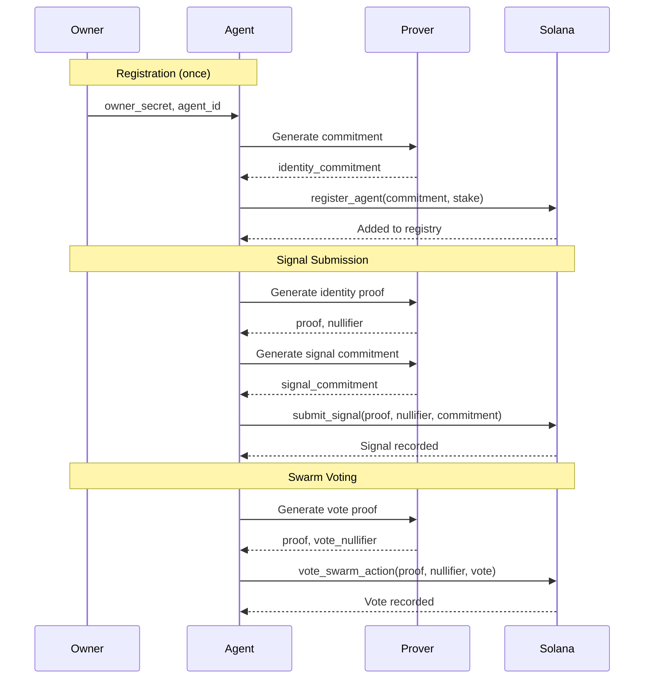
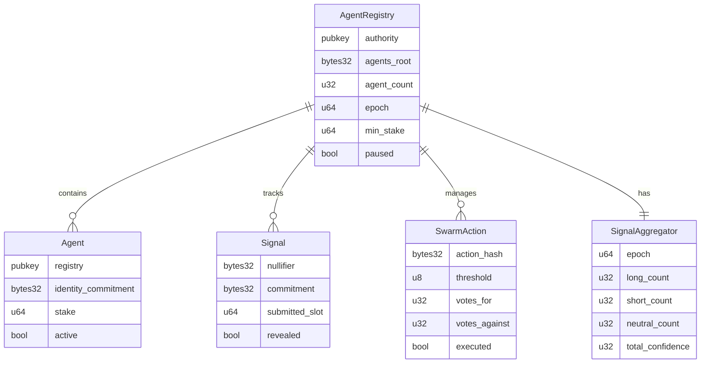
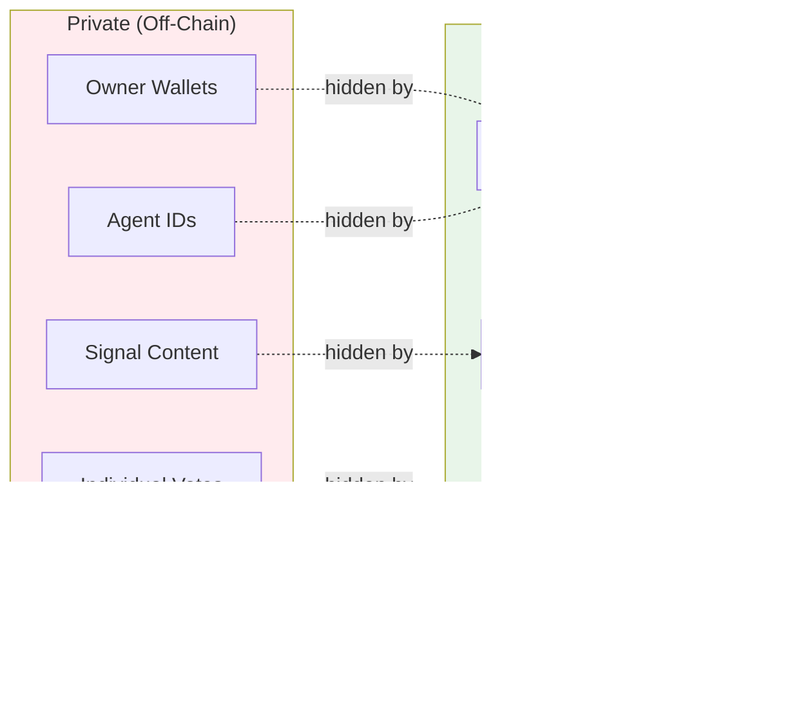

# Architecture

## System Overview

```mermaid
flowchart TB
    subgraph Owners["Agent Owners (Hidden)"]
        O1[Owner A]
        O2[Owner B]
        O3[Owner C]
    end

    subgraph Agents["AI Agents"]
        A1[Agent 1]
        A2[Agent 2]
        A3[Agent 3]
    end

    subgraph ZK["Zero-Knowledge Layer"]
        IC[Identity Commitment<br/>Poseidon Hash]
        MT[Merkle Tree<br/>Membership Proofs]
        NL[Nullifiers<br/>Double-Spend Prevention]
    end

    subgraph Solana["Solana Program"]
        REG[Registry<br/>• agents_root<br/>• epoch<br/>• config]
        SIG[Signals<br/>• commitment<br/>• nullifier]
        ACT[Swarm Actions<br/>• votes<br/>• threshold]
        AGG[Aggregator<br/>• long/short/neutral<br/>• avg confidence]
    end

    O1 -.->|secret| A1
    O2 -.->|secret| A2
    O3 -.->|secret| A3

    A1 --> IC
    A2 --> IC
    A3 --> IC

    IC --> MT
    MT --> NL

    NL -->|ZK Proof| REG
    NL -->|ZK Proof| SIG
    NL -->|ZK Proof| ACT

    SIG -->|reveal| AGG
```

## Proof Flow

```mermaid
sequenceDiagram
    participant Owner
    participant Agent
    participant Prover
    participant Solana

    Note over Owner,Agent: Registration (once)
    Owner->>Agent: owner_secret, agent_id
    Agent->>Prover: Generate commitment
    Prover-->>Agent: identity_commitment
    Agent->>Solana: register_agent(commitment, stake)
    Solana-->>Agent: Added to registry

    Note over Owner,Solana: Signal Submission
    Agent->>Prover: Generate identity proof
    Prover-->>Agent: proof, nullifier
    Agent->>Prover: Generate signal commitment
    Prover-->>Agent: signal_commitment
    Agent->>Solana: submit_signal(proof, nullifier, commitment)
    Solana-->>Agent: Signal recorded

    Note over Owner,Solana: Swarm Voting
    Agent->>Prover: Generate vote proof
    Prover-->>Agent: proof, vote_nullifier
    Agent->>Solana: vote_swarm_action(proof, nullifier, vote)
    Solana-->>Agent: Vote recorded
```

## Data Structures

```mermaid
erDiagram
    AgentRegistry ||--o{ Agent : contains
    AgentRegistry ||--o{ Signal : tracks
    AgentRegistry ||--o{ SwarmAction : manages
    AgentRegistry ||--|| SignalAggregator : has

    AgentRegistry {
        pubkey authority
        bytes32 agents_root
        u32 agent_count
        u64 epoch
        u64 min_stake
        bool paused
    }

    Agent {
        pubkey registry
        bytes32 identity_commitment
        u64 stake
        bool active
    }

    Signal {
        bytes32 nullifier
        bytes32 commitment
        u64 submitted_slot
        bool revealed
    }

    SwarmAction {
        bytes32 action_hash
        u8 threshold
        u32 votes_for
        u32 votes_against
        bool executed
    }

    SignalAggregator {
        u64 epoch
        u32 long_count
        u32 short_count
        u32 neutral_count
        u32 total_confidence
    }
```

## Privacy Guarantees

```mermaid
flowchart LR
    subgraph Public["Public (On-Chain)"]
        P1[Identity Commitments]
        P2[Signal Commitments]
        P3[Nullifiers]
        P4[Aggregate Stats]
    end

    subgraph Private["Private (Off-Chain)"]
        S1[Owner Wallets]
        S2[Agent IDs]
        S3[Signal Content]
        S4[Individual Votes]
    end

    S1 -.->|hidden by| P1
    S2 -.->|hidden by| P1
    S3 -.->|hidden by| P2
    S4 -.->|hidden by| P3

    style Public fill:#e8f5e9
    style Private fill:#ffebee
```
